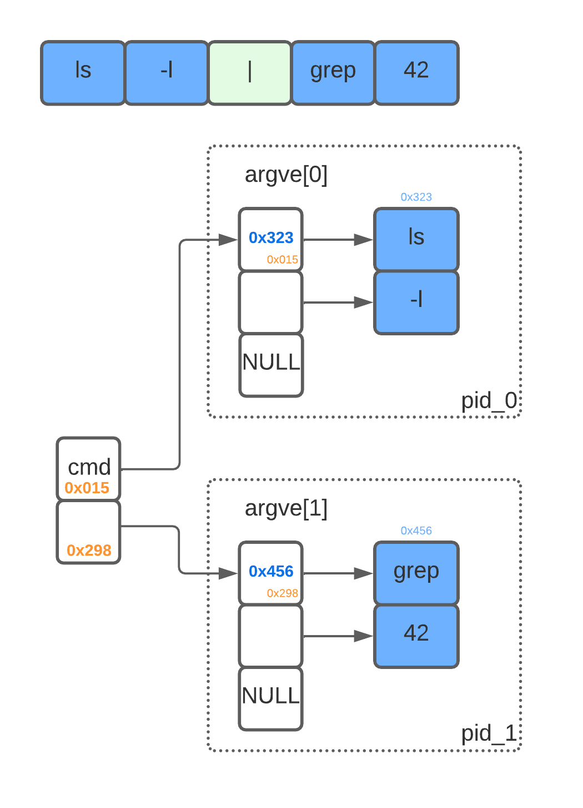

# minishell42

**lembrar de falar do echo proc na reuniao

## Estrutura dos tokens de cmd:
</br></br>


--------

# Libft42

The aim of this project is to code a C library regrouping usual functions that
we’ll be allowed to use in all us other projects at 42.

The most part is in C library (see man). 
Others are'nt in the C library but it will be so usefull further. This functions are described in subject.

## Use:

🚧 Build project functions:<br/>
```
42Libft $ make
```
🚧 🚧 Build bonus (project functions + bonus):<br/>
```
42Libft $ make bonus
```
🚿 Clean Obj files:<br/>
```
42Libft $ make clean
```
🚿 🚿 Clean All (obj files + binary):<br/>
```
42Libft $ make fclean
```
🚿 🚧 Clean All + build:<br/>
```
42Libft $ make re
```

<br/>See Makefile

-----------------------------------------------
# Printf42
Printf function recoded, with limited specifiers and flags. Because putnbr and putstr aren’t enough!

## Use:

🚧 project:<br/>
```
42Libft $ make
```
🚿 Clean Obj files:<br/>
```
42Libft $ make clean
```
🚿 🚿 Clean All (obj files + binary):<br/>
```
42Libft $ make fclean
```
🚿 🚿 🚧 Clean All + build:<br/>
```
42Libft $ make re
```

<br/>See Makefile<br/>
<h2><b>Logic</b></h2>

Basically, this printf works on demand. It goes through the string and, at each step, prints the character found. (Like a char machine gun - the char found is printed and counted).
If printf finds the formatting character <b>'%'</b>, it stores the formatting instructions (the flags) in a structure to later format the output according to the stored flags.

Below, a ft_printf's logic:


<h2><b>Var's scope</b></h2>

The function has many variables and each one is used in more than one function. This flowchart helps to understand the variables scope.

Below, a ft_printf's vars scope:


---------------------------------------------------------
# Get_next_line42
The aim of this project is to code a function that returns a line ending with a newline, read from a file descriptor.<br/>
## Use:

🚧 project:<br/>
```
42Libft $ make
```
:shower: Clean Obj files:<br/>
```
42Libft $ make clean
```
:shower: :shower: Clean All (obj files + binary):<br/>
```
42Libft $ make fclean
```
:shower: :shower: 🚧 Clean All + build:<br/>
```
42Libft $ make re
```

<br/>See Makefile<br/>

<h2><b>Main Idea</b></h2>

Here, a simple drawning about the main idea: copy buffer until find a '\n', keeping the residual for the next call.


<h2><b>Logic</b></h2>

Below, a get_next_line's flowchart - Before final version:
(Note: This diagram is not complete. After reading the file, there is no residue, that is, when EOF is reached, the buffer is still checked by repeating the buffer breaking process if there is '/ n'. This diagram served more for an initial understanding. The final version, below in this document, is more detailed and assertive.)


<h2><b>GNL Vars</b></h2>

The get_next_line's variables. 
Note that the bonus part (The part that treats with various files at same time), uses an string''s array, like shows the figure below, called by residual[fd]. Where each position referes to particular FD. 
On the simple get_next_line, the mandatory part, this is a simple string var.(residual).

<b>Var list:</b>

- <b>buff:</b> Read buffer (used on read function, to keep the read part)
- <b>residual:</b> residue buffer (has the same size of buff, and keep the residue of buff, after the buff is append on the line)
- <b>oneline:</b> Flag that indicates that function reach a line

(Note: As the buffer variable is only used within gnl_core, I chose to use a simple pointer, that is, I don't need its reference outside the scope of this function. So, the correct thing in this diagram is just buf and * buf. Like the diagram above, this was only used to understand the data structure.)


<h2><b>FINAL VERSION</b></h2>

To according with moulinette, i had to split my function, because it had more than 70 lines. So, i've created a "gnl_core", that resumes the main logic of the code. Some functions, had your names changed to seem more useful to understanding.


<h2><b>testers</b></h2>

[42TESTERS-GNL](https://github.com/Mazoise/42TESTERS-GNL)

[42cursus_gnl_tests](https://github.com/mrjvs/42cursus_gnl_tests)

[GNL_Lover](https://github.com/charMstr/GNL_lover)

[Get_Next_Line_Tester](https://github.com/Hellio404/Get_Next_Line_Tester)

[gnl_tester](https://github.com/lgrellie/gnl_tester)

--------------------------------------------------

# 42PushSwap  

## About
This project will make you sort data on a stack, with a limited set of instructions, using
the lowest possible number of actions. To succeed you’ll have to manipulate various
types of algorithms and choose the one (of many) most appropriate solution for an
optimized data sorting. </br></br>
The Push_swap project is a very simple and highly effective algorithm project: data will
need to be sorted. You have at your disposal a set of int values, 2 stacks and a set of
instructions to manipulate both stacks.</br></br>
</br>
(by [Hemsi Game](https://phemsi-a.itch.io/push-swap))</br></br>
Your goal ? Write a program in C called push_swap which calculates and displays
on the standard output the smallest program using Push_swap instruction language that
sorts the integer arguments received.</br></br>
I choose [Radix Sort](https://www.youtube.com/watch?v=nu4gDuFabIM) due its brilhant resolution and due to its complexity (O (n log(n)), same as QuickSort, in the middle case. [see](https://pt.stackoverflow.com/questions/56836/defini%C3%A7%C3%A3o-da-nota%C3%A7%C3%A3o-big-o#:~:text=A%20ideia%20da%20nota%C3%A7%C3%A3o%20Big,%2C%20genericamente%2C%20por%20n%20))</br></br>
Use like this:
```
$ make
$ ./push_swap {{int_numbers}}
$ (You can use an script to shuffle: ARG=$(ruby -e "puts (-50..49).to_a.shuffle.join(' ')") (To shuffle 100 numbers, for example)
$ ./push_swap $ARG
```
</br>

*Note: If you want to view the stacks, use the print_to_terminal.c function in the debbug folder. Just include the file name in the Makefile, the function definition in the .h file and use it inside the order_\* functions, at the end, before releasing the stacks, if any. (free_stack command)*. </br></br>
*Important: For testing, don't print the stack, just the commands. That is, don't use the print_to_terminal.c function (That's exactly why it wasn't included, but left as gift)*.
</br></br>

## Testing: </br>

### To test with checker:
```
$ ARG=$(ruby -e "puts (0..499).to_a.shuffle.join(' ')")
$ ./push_swap $ARG | ./checker_linux $ARG
```
### To test by peer's test:
(by [Lais Arena](https://github.com/laisarena)) </br></br>
</br></br>
## Visualizing: </br>
(by [O-reo](https://github.com/o-reo/push_swap_visualizer), in the range [-50, 50]) </br></br>

## Ckeck 42norm: </br>
(by [42School_norm](https://github.com/42School/norminette/blob/master/pdf/pt_br.norm.pdf)) </br></br>


